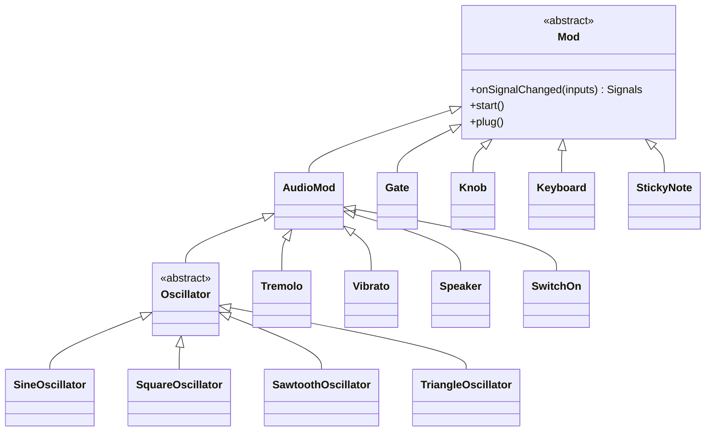

# Architecture

Synt is a browser-based **modular synthesizer**. Users assemble audio modules on a grid-based rack, connect their plugs, and build custom signal chains — from oscillators through effects to a speaker output.

## Core Concepts

### Mod

`Mod` is the abstract base class every module extends. Each instance:

- Occupies one or more rectangular slots on the rack grid (`x`, `y`, `width`, `height`)
- Has exactly **4 plugs**, one on each side (NORTH, EAST, SOUTH, WEST)
- Can be dragged and dropped to any free grid slot
- Implements `onSignalChanged(inputSignals)` to define its audio/control behaviour

The only method subclasses must override is `onSignalChanged`. It receives the current signals on all four plugs and returns the output signals to propagate downstream.

```ts
onSignalChanged(inputSignals: Signals): Signals
// inputSignals[PlugPosition.NORTH] → signal arriving on the north plug
// return value[PlugPosition.SOUTH] → signal emitted on the south plug
```

`AudioMod` is a thin semantic subclass of `Mod` that marks audio-processing modules (oscillators, effects, speaker). Control-only modules (e.g. `Knob`) extend `Mod` directly.

---

### Signal

Every value flowing between modules is a `Signal`. There are three concrete types:

| Type | Description |
|------|-------------|
| `AudioSignal` | Wraps a Tone.js `ToneAudioNode`. Represents an audio stream. |
| `ControlSignal` | Carries a single numeric value (typically 0–1). Used to modulate parameters such as frequency or gain. |
| `BrokenAudioSignal` | Wraps the last valid `ToneAudioNode` but marks it as disconnected. Propagated downstream when a module is removed or a plug is unlinked, so that downstream nodes can call `disconnect()` and clean up the audio graph. |

Signals implement `eq(other: Signal): boolean` for change detection — `onSignalChanged` is only called when the incoming signal actually differs from the previous one.

---

### Plug and PlugType

Each of the four sides of a module has a `Plug` with one of these types (defined as symbols in `PlugType`):

| Symbol | Meaning |
|--------|---------|
| `PlugType.OUT` | Audio output |
| `PlugType.IN` | Audio input |
| `PlugType.CTRLOUT` | Control output |
| `PlugType.CTRLIN` | Control input |
| `PlugType.NULL` | No plug on this side |

**Valid connections:** `OUT ↔ IN` (audio) and `CTRLOUT ↔ CTRLIN` (control). Any other pairing is rejected by `Plug.isLinkable()`. Connections are one-to-one: a plug can be linked to at most one other plug at a time.

**Visual colour coding** makes compatible plugs recognisable at a glance:

| Plug type | Colour |
|-----------|--------|
| `IN` | Green / Red split |
| `OUT` | Red / Green split |
| `CTRLIN` | Blue / Orange split |
| `CTRLOUT` | Orange / Blue split |

---

### Rack

`Rack` is the top-level container. It:

- Manages the Konva.js `Stage` and renders the grid
- Maintains a 2D grid (`grid[x][y]`) to track occupied slots and prevent overlaps
- Handles drag-and-drop: shows a ghost shadow at the target slot; snaps the module back if the slot is occupied
- Initialises the Tone.js audio context on the first user interaction (required by browser autoplay policy)
- Supports zoom (scroll wheel) and pan (drag on empty space)

---

## Module Categories

| Directory | Role | Extends |
|-----------|------|---------|
| `oscillator/` | Audio generators | `AudioMod` |
| `effect/` | Audio processors | `AudioMod` |
| `filter/` | Audio filters | `AudioMod` |
| `control/` | User input & signal gating | `Mod` / `AudioMod` |
| `output/` | Audio sink | `AudioMod` |

### Oscillators (`oscillator/`)

`Oscillator` is the abstract base. Concrete variants — `SineOscillator`, `SquareOscillator`, `SawtoothOscillator`, `TriangleOscillator` — each wrap the corresponding Tone.js oscillator type.

Default plug layout:
- NORTH: `NULL`
- EAST: `CTRLIN` (optional frequency control)
- SOUTH: `OUT` (audio output)
- WEST: `NULL`

The Tone.js oscillator node is created lazily on the first `onSignalChanged` call and started immediately. If a `ControlSignal` is present on EAST, its value is mapped to frequency: `frequency = controlValue × 400`.

### Effects (`effect/`)

`Tremolo` and `Vibrato` both follow the same pattern:

- NORTH: `IN` (audio input)
- EAST: `CTRLIN` (effect rate control)
- SOUTH: `OUT` (audio output)

They create a Tone.js effect node on-demand, connect the incoming audio node to it, and wire up the rate from the control signal. When a `BrokenAudioSignal` arrives they call `dispose()` to release the audio node.

### Filters (`filter/`)

`HighPassFilter` wraps Tone.js `Filter` in `'highpass'` mode.

Default plug layout:
- NORTH: `IN` (audio input)
- EAST: `CTRLIN` (cutoff frequency control, maps 0–1 → 0–4000 Hz)
- SOUTH: `OUT` (audio output)

The Tone.js `Filter` node is recreated each time a new upstream `AudioSignal` arrives. On `BrokenAudioSignal` the node is released via `queueMicrotask`.

### Controls (`control/`)

| Module | Plug layout | Behaviour |
|--------|-------------|-----------|
| `Knob` | WEST: `CTRLOUT` | Mouse-wheel or vertical touch-drag changes value in [0, 1]. Emits a `ControlSignal`. |
| `Gate` | NORTH: `IN`, SOUTH: `OUT` | Transparent pass-through — forwards any signal unchanged. |
| `SwitchOn` | NORTH: `IN`, SOUTH: `OUT` | Press/hold to pass audio; release emits `BrokenAudioSignal` to cut the downstream chain. |
| `Keyboard` | WEST: `CTRLOUT` | Visual keyboard display; reserved for future MIDI/keyboard input. |

### Output (`output/`)

`Speaker` is the terminal sink. It has no output plugs:

- NORTH: `IN` (audio input)
- EAST: `CTRLIN` (optional gain, 0–1)

On receiving an `AudioSignal` it creates a `Tone.Gain` node, connects the incoming audio node to it, and connects the gain node to the Tone.js destination (system output). On `BrokenAudioSignal` it calls `dispose()` to release the nodes.

---

## Inheritance Hierarchy



---

## Signal Flow & Propagation

Synt uses a **push-based** propagation model. When any module's state changes (e.g. a knob is turned, a plug is connected), propagation starts from the **entry modules** and pushes signals downstream.

### Entry modules

A module is an *entry* if it has at least one linked output plug (`OUT` or `CTRLOUT`) and no linked input plugs (`IN` or `CTRLIN`). Oscillators and knobs are the typical entries.

`findEntries()` walks upstream from any module by following input plugs until it reaches modules with no inputs — those are the entries.

### Propagation steps

```
Entry module
  │  start()
  ▼
onSignalChanged(inputs) → output Signals
  │  pushOutput(plugPosition, signal)
  ▼
Linked module's plug
  │  pushInput(plugPosition, signal)
  ▼
onSignalChanged(inputs) → output Signals
  │  ...and so on
```

### Deduplication

`lastPropagationId` stamps each propagation run. If a module receives the same propagation ID more than once (possible in a diamond-shaped graph), subsequent calls are dropped. Combined with `signal.eq()` change detection, this prevents both redundant recomputation and infinite loops.

---

## Connection Rules

| From | To | Valid? |
|------|----|--------|
| `OUT` | `IN` | ✅ Audio |
| `CTRLOUT` | `CTRLIN` | ✅ Control |
| `OUT` | `CTRLIN` | ❌ |
| `CTRLOUT` | `IN` | ❌ |
| Any | `NULL` | ❌ |

Connections are validated by `Plug.isLinkable()` before any link is established.

---

## Key Design Patterns

### Lazy Tone.js node creation

Modules don't allocate a Tone.js audio node in their constructor. The node is created the first time `onSignalChanged` is called with a valid input, deferring resource allocation until the module is actually wired into a live signal chain.

### Graceful disconnection via `BrokenAudioSignal`

When a plug is unlinked or a module is moved, the upstream plug emits a `BrokenAudioSignal` (wrapping the last known `ToneAudioNode`). Each downstream module that receives it:

1. Detects `instanceof BrokenAudioSignal`
2. Calls `dispose()` on its Tone.js node (which disconnects all connections)
3. Forwards the `BrokenAudioSignal` further downstream

This prevents orphaned audio nodes and avoids audible glitches from dangling connections.

### Change detection

Before calling `onSignalChanged`, `pushInput` compares the new signal against the previously received signal using `signal.eq()`. If they are identical the module's computation is skipped and only propagation continues, avoiding unnecessary work for static values (e.g. a knob that hasn't moved).

### Entry-point pattern

Rather than maintaining a global list of "root" modules, `findEntries()` discovers entries dynamically at propagation time by climbing the input-plug chain. This means any module configuration — including ones assembled at runtime — is handled correctly without extra bookkeeping.
