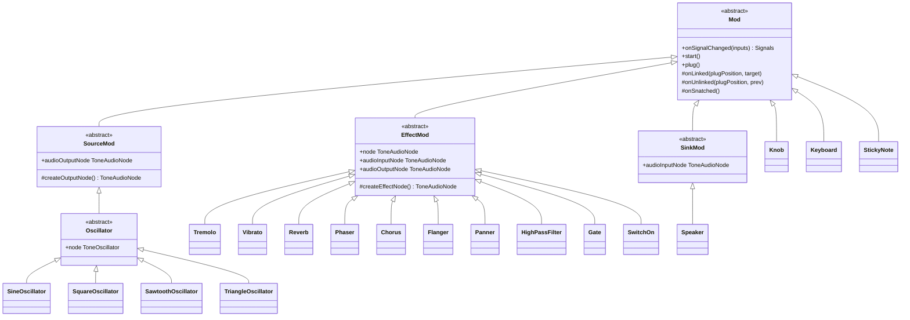

# Architecture

Synt is a browser-based **modular synthesizer**. Users assemble audio modules on a grid-based rack, connect their plugs, and build custom signal chains — from oscillators through effects to a speaker output.

## Core Concepts

### Mod

`Mod` is the abstract base class every module extends. Each instance:

- Occupies one or more rectangular slots on the rack grid (`x`, `y`, `width`, `height`)
- Has exactly **4 plugs**, one on each side (NORTH, EAST, SOUTH, WEST)
- Can be dragged and dropped to any free grid slot
- Implements `onSignalChanged(inputSignals)` to define its audio/control behaviour

The only method subclasses must override is `onSignalChanged`. It receives the current signals on all four plugs and returns the output signals to propagate downstream.

```ts
onSignalChanged(inputSignals: Signals): Signals
// inputSignals[PlugPosition.NORTH] → signal arriving on the north plug
// return value[PlugPosition.SOUTH] → signal emitted on the south plug
```

Three specialised base classes extend `Mod` for audio-processing modules:

| Class | Role |
|-------|------|
| `SourceMod` | Audio generators — manages a Tone.js output node; calls `connect()` on link |
| `EffectMod` | Audio processors — manages a single Tone.js node that acts as both input and output |
| `SinkMod` | Audio sinks — manages a `ToneGain` node connected to the system destination |

Control-only modules (e.g. `Knob`) extend `Mod` directly.

---

### Signal

The only signal type used for inter-module communication is `ControlSignal`:

| Type | Description |
|------|-------------|
| `ControlSignal` | Carries a single numeric value in the range `[0, 1]`. Used to modulate parameters such as frequency or gain. |

**Audio routing** does not use signals. When two audio plugs are linked, `SourceMod` and `EffectMod` call `connect()` on the underlying Tone.js node directly via the `onLinked` hook. When a plug is unlinked or a module is removed, `disconnect()` / `dispose()` are called via `onUnlinked` and `onSnatched`.

`ControlSignal` implements `eq(other: Signal): boolean` for change detection — `onSignalChanged` is only called when the incoming signal actually differs from the previous one.

---

### Plug and PlugType

Each of the four sides of a module has a `Plug` with one of these types (defined as symbols in `PlugType`):

| Symbol | Meaning |
|--------|---------|
| `PlugType.OUT` | Audio output |
| `PlugType.IN` | Audio input |
| `PlugType.CTRLOUT` | Control output |
| `PlugType.CTRLIN` | Control input |
| `PlugType.NULL` | No plug on this side |

**Valid connections:** `OUT ↔ IN` (audio) and `CTRLOUT ↔ CTRLIN` (control). Any other pairing is rejected by `Plug.isLinkable()`. Connections are one-to-one: a plug can be linked to at most one other plug at a time.

**Visual colour coding** makes compatible plugs recognisable at a glance:

| Plug type | Colour |
|-----------|--------|
| `IN` | Green / Red split |
| `OUT` | Red / Green split |
| `CTRLIN` | Blue / Orange split |
| `CTRLOUT` | Orange / Blue split |

---

### Rack

`Rack` is the top-level container. It:

- Manages the Konva.js `Stage` and renders the grid
- Maintains a 2D grid (`grid[x][y]`) to track occupied slots and prevent overlaps
- Handles drag-and-drop: shows a ghost shadow at the target slot; snaps the module back if the slot is occupied
- Initialises the Tone.js audio context on the first user interaction (required by browser autoplay policy)
- Supports zoom (scroll wheel) and pan (drag on empty space)

---

## Module Categories

| Directory | Role | Extends |
|-----------|------|---------|
| `oscillator/` | Audio generators | `SourceMod` |
| `effect/` | Audio processors | `EffectMod` |
| `filter/` | Audio filters | `EffectMod` |
| `control/` | User input & signal gating | `Mod` / `EffectMod` |
| `output/` | Audio sink | `SinkMod` |

### Oscillators (`oscillator/`)

`Oscillator` is the abstract base. Concrete variants — `SineOscillator`, `SquareOscillator`, `SawtoothOscillator`, `TriangleOscillator` — each wrap the corresponding Tone.js oscillator type.

Default plug layout:
- NORTH: `NULL`
- EAST: `CTRLIN` (optional frequency control)
- SOUTH: `OUT` (audio output)
- WEST: `NULL`

Each concrete oscillator implements `createOutputNode()` to return the matching `ToneOscillator` type. The node is created lazily the first time the oscillator is wired into a signal chain (via `onLinked`). When a `ControlSignal` arrives on EAST, `mapControl` maps its value to frequency: `frequency = controlValue × 400`.

### Effects (`effect/`)

All effects follow the same `EffectMod` pattern:

- NORTH: `IN` (audio input)
- EAST: `CTRLIN` (one or more CV control inputs)
- SOUTH: `OUT` (audio output)

Each effect implements `createEffectNode()` to instantiate its Tone.js node. The node is created lazily when first linked. Tone.js `connect()` / `disconnect()` calls are handled automatically by `EffectMod` via the `onLinked` / `onUnlinked` / `onSnatched` lifecycle hooks. CV parameters are applied by overriding `mapControl(plugPosition, value)`.

### Filters (`filter/`)

`HighPassFilter` wraps Tone.js `Filter` in `'highpass'` mode.

Default plug layout:
- NORTH: `IN` (audio input)
- EAST: `CTRLIN` (cutoff frequency control, maps 0–1 → 0–4000 Hz)
- SOUTH: `OUT` (audio output)

`HighPassFilter` extends `EffectMod`. The Tone.js `Filter` node is created lazily on first link and managed by the base class lifecycle hooks. The `mapControl` override maps the CV value to the filter's `frequency` parameter.

### Controls (`control/`)

| Module | Plug layout | Behaviour |
|--------|-------------|-----------|
| `Knob` | WEST: `CTRLOUT` | Mouse-wheel or vertical touch-drag changes value in [0, 1]. Emits a `ControlSignal`. |
| `Gate` | NORTH: `IN`, SOUTH: `OUT` | Extends `EffectMod` with a `ToneGain(1)` effect node — audio passes through at full volume. |
| `SwitchOn` | NORTH: `IN`, SOUTH: `OUT` | Extends `EffectMod` with a `ToneGain(0)` — `pressOn()` sets gain to 1; `pressOff()` sets gain to 0. |
| `Keyboard` | WEST: `CTRLOUT` | Visual keyboard display; reserved for future MIDI/keyboard input. |

### Output (`output/`)

`Speaker` extends `SinkMod`. It has no output plugs:

- NORTH: `IN` (audio input)
- EAST: `CTRLIN` (optional gain, 0–1)

`SinkMod` lazily creates a `ToneGain` node connected to `getDestination()` (the system audio output) the first time an upstream plug is linked. When the `CTRLIN` receives a `ControlSignal`, the gain value is updated in real time.

---

## Inheritance Hierarchy



---

## Signal Flow & Propagation

Synt uses two separate mechanisms for audio and control signals.

### Audio routing (Tone.js graph wiring)

Audio never travels as a message between modules. When two audio plugs are **linked**, `SourceMod` or `EffectMod` calls `connect()` on the Tone.js node immediately via `onLinked`:

```
oscillator.plug([null, null, speaker, null])
  → oscillator.onLinked(SOUTH, speaker)
  → oscillator.outputNode.connect(speaker.audioInputNode)
```

When a plug is **unlinked** or a module is **snatched** (removed), `disconnect()` / `dispose()` are called via `onUnlinked` and `onSnatched`.

### Control routing (push-based propagation)

`ControlSignal` values propagate through the graph using a push model. When a knob is turned:

```
Knob (entry)
  │  start() / pushOutput(WEST, controlSignal)
  ▼
onSignalChanged(inputs) → output Signals
  │  pushOutput(plugPosition, signal)
  ▼
Connected module
  │  ...and so on
```

### Entry modules

A module is an *entry* if it has at least one linked output plug (`OUT` or `CTRLOUT`) and no linked input plugs (`IN` or `CTRLIN`). Oscillators and knobs are the typical entries.

`findEntries()` walks upstream from any module by following input plugs until it reaches modules with no inputs — those are the entries.

### Deduplication

`lastPropagationId` stamps each propagation run. If a module receives the same propagation ID more than once (possible in a diamond-shaped graph), subsequent calls are dropped. Combined with `signal.eq()` change detection, this prevents both redundant recomputation and infinite loops.

---

## Connection Rules

| From | To | Valid? |
|------|----|--------|
| `OUT` | `IN` | ✅ Audio |
| `CTRLOUT` | `CTRLIN` | ✅ Control |
| `OUT` | `CTRLIN` | ❌ |
| `CTRLOUT` | `IN` | ❌ |
| Any | `NULL` | ❌ |

Connections are validated by `Plug.isLinkable()` before any link is established.

---

## Key Design Patterns

### Lazy Tone.js node creation

Modules don't allocate a Tone.js audio node in their constructor. The node is created lazily the first time `onLinked` fires (i.e. when the module is wired into a live audio chain), deferring resource allocation until it is needed.

### Topology-driven audio graph management

When plugs are connected or disconnected, `SourceMod` and `EffectMod` call `connect()` / `disconnect()` on the Tone.js nodes directly via the lifecycle hooks `onLinked`, `onUnlinked`, and `onSnatched`. When a module is removed (`snatch()`), `onSnatched()` calls `dispose()` on its Tone.js node, releasing all Web Audio resources cleanly.

### Change detection

Before calling `onSignalChanged`, `pushInput` compares the new signal against the previously received signal using `signal.eq()`. If they are identical the module's computation is skipped and only propagation continues, avoiding unnecessary work for static values (e.g. a knob that hasn't moved).

### Entry-point pattern

Rather than maintaining a global list of "root" modules, `findEntries()` discovers entries dynamically at propagation time by climbing the input-plug chain. This means any module configuration — including ones assembled at runtime — is handled correctly without extra bookkeeping.
